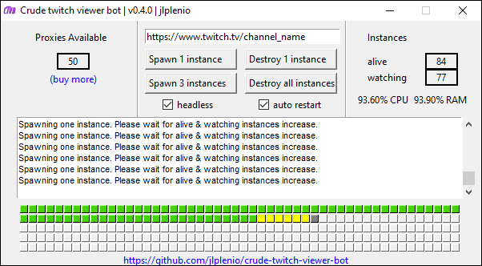
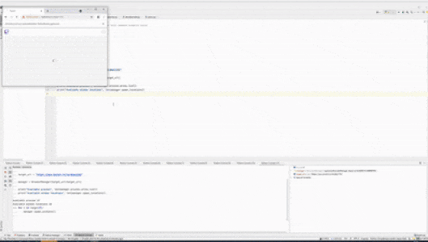

# Crude Twitch Viewer Bot (CTVBot)

Disclaimer: For educational purpose only!

Small tool that spawns muted Google Chrome instances via [Playwright](https://github.com/microsoft/playwright-python), each with a different user-agent and HTTP proxy connection. 
Each instance navigates to the twitch channel, activates theater mode and adheres itself to the available screen space. 
Settings in localStorage ensure the lowest possible resolution.

- Download the one-file executable for Windows from the [latest CTVBot release](https://github.com/jlplenio/crude-twitch-viewer-bot/releases/latest).  

Read the comprehensive [wiki](https://github.com/jlplenio/crude-twitch-viewer-bot/wiki) for a [detailed tutorial](https://github.com/jlplenio/crude-twitch-viewer-bot/wiki/Detailed-Tutorial), [usage tips](https://github.com/jlplenio/crude-twitch-viewer-bot/wiki/Advanced-features-and-controls) and [troubleshooting steps](https://github.com/jlplenio/crude-twitch-viewer-bot/wiki/Troubleshooting).

[:coffee: You can sponsor me a coffee](https://ko-fi.com/jlplenio) if you enjoy this tool and want to support its continued development. 

### Important
- You need to provide your own HTTP proxies to the [proxy_list.txt](proxy/proxy_list.txt)  
  Buy trusted proxies [here](https://www.webshare.io/?referral_code=w6nfvip4qp3g) or follow the [Webshare.io Proxies Guide](https://github.com/jlplenio/crude-twitch-viewer-bot/wiki/Webshare.io-Proxies-Guide).
- Chrome needs to be already installed on your system.
- Tested with instance count: Headless ~100, headful ~30.
- Tested on Windows 10.
- CPU load and bandwidth can get heavy. Channels with 160p work best.

### In Action

#### Color codes of the square boxes

⬛ - Instance is spawned.    🟨 - Instance is buffering.    🟩 - Instance is actively watching.
 
#### Headful Spawning
  
(If you go headless, the browser windows will be invisible)  

### Usage Windows

Read the comprehensive [wiki](https://github.com/jlplenio/crude-twitch-viewer-bot/wiki) for a [detailed tutorial](https://github.com/jlplenio/crude-twitch-viewer-bot/wiki/Detailed-Tutorial), [usage tips](https://github.com/jlplenio/crude-twitch-viewer-bot/wiki/Advanced-features-and-controls) and [troubleshooting steps](https://github.com/jlplenio/crude-twitch-viewer-bot/wiki/Troubleshooting).

#### Quickstart Steps
Download the one-file executable for Windows from the [latest CTVB release](https://github.com/jlplenio/crude-twitch-viewer-bot/releases/latest).

1. Extract zip file to a folder.
2. Add your proxies to proxy/proxy_list.txt.  
Buy trusted proxies [here](https://www.webshare.io/?referral_code=w6nfvip4qp3g) or follow the [Webshare.io Proxies Guide](https://github.com/jlplenio/crude-twitch-viewer-bot/wiki/Webshare.io-Proxies-Guide).
3. Start executable and wait for the GUI to appear.
4. Spawn instances patiently.

#### Interactions with the square boxes
🖱️ Left click: Refresh page.  
🖱️ Right click: Destroy instance.  
🖱️ Left click + CTRL: Take screenshot (saved in root folder).   

